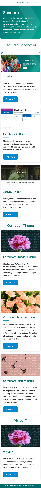

# YMCA Website Services Sandboxes landing page

## Screenshots

### Desktop

### Mobile

## Source

### Design

Redesigned to match the Small Y (openy_carnation) theme with:
- Teal color scheme (`#01a490` primary, `#006b6b` dark)
- Ping-pong card layout (image + text alternating sides)
- Hero banner with chevron arrow and gradient background
- White header, teal footer
- Rounded buttons and card corners

### Sandbox Domain Names

- sandboxes.y.org

- sandbox-carnation-cus.y.org
- sandbox-carnation-ext.y.org
- sandbox-carnation-std.y.org

- sandbox-carnation-std-virtual-y.y.org
- sandbox-carnation-std-membership-framework.y.org
- sandbox-carnation-cus-d9.y.org

### Header

"Back to YMCA Website Services.org" points to https://ycloud.y.org/open-y-association-websites/.

### Fonts

- Quicksand, regular and bold
- Roboto, regular and medium

Loaded from Google Fonts.

### Theme palette

- teal `#01a490` (primary brand)
- teal dark `#006b6b` (headings, footer, buttons)
- blue `#0089d0` (accent, dividers, button hover)
- dark gray `#2f2f2f` (body text)
- light grey `#F2F2F2`
- white `#FFFFFF`

# Development

## Stack

- **Vite 6** — build tool and dev server
- **TypeScript** — type-safe scripts
- **Tailwind CSS v4** — utility-first styling
- **Nunjucks** (via Vituum) — templating engine
- **Playwright** — visual regression testing

## Usage

Project installation:

`npm install`

To start local environment:

`npm run dev`

To build production artifacts:

`npm run build`

To preview production build:

`npm run preview`

## Project structure

- `vite.config.ts` — Vite configuration with Vituum, Nunjucks, and Tailwind plugins
- `tsconfig.json` — TypeScript configuration
- `playwright.config.ts` — Playwright test configuration
- `src/` — contains all the source files:
   - `layouts/base.njk` — the base HTML layout (head, header, footer)
   - `pages/index.njk` — the main page content with hero banner
   - `components/card.njk` — ping-pong card component template
   - `styles/main.css` — Tailwind CSS imports, theme config, hero banner, and ping-pong card styles
   - `scripts/main.ts` — TypeScript entry point
   - `data/global.json` — page content data (auto-loaded by Vituum)
   - `assets/` — all images used in the page
- `public/` — static assets served at root (favicon, og_image)
- `tests/` — Playwright visual comparison tests

### global.json

The file describes all the content needed to build the static page.

Structure:

- `title` — the page title, used in meta tags
- `description` — the page description, used in meta tags
- `url` — the URL where this page is hosted, used in meta tags
- `header` — the content header (displayed in hero banner)
- `intro` — the intro text (displayed in hero banner)
- `sections` — array of section objects:
  - `title` — section heading
  - `cards` — array of card objects:
    - `id` — the card id, used as HTML `id` attribute and in CSS for background images
    - `link` — a link to a sandbox website
    - `title` — a card title
    - `description` — a card body content, non-sanitized, can contain HTML markup
